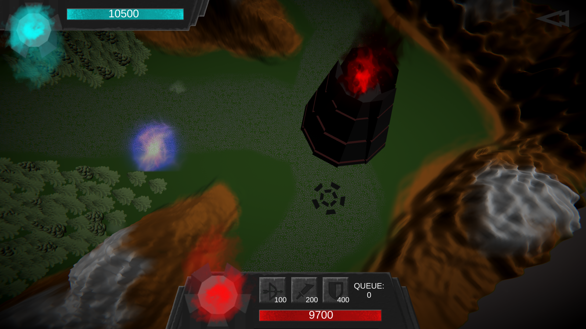
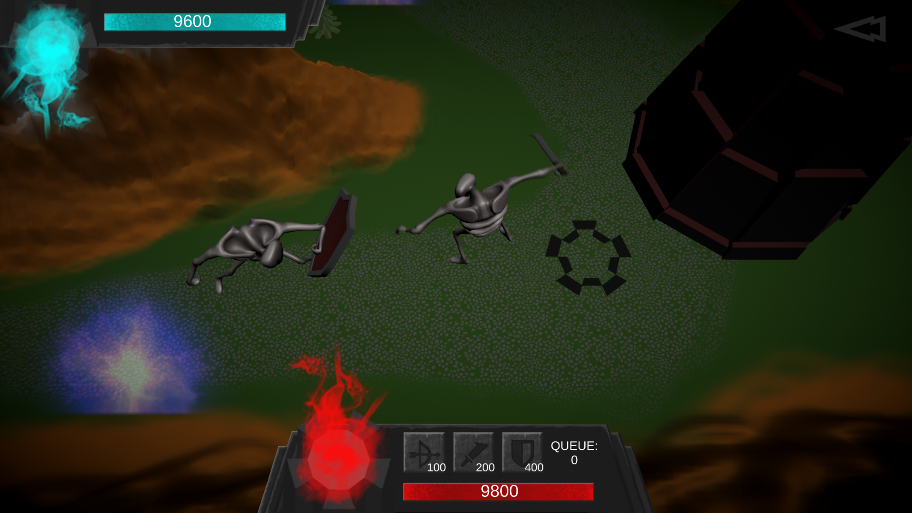
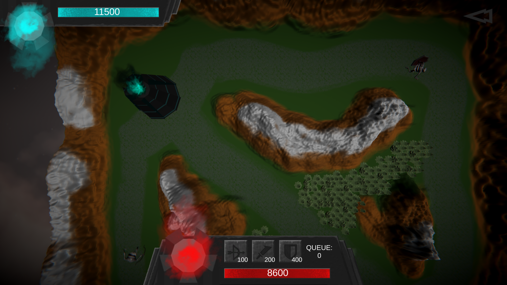

# Dead Sirius
A tiny tower defense where you pay for your units by your own health points and get them back from dead enemies and portals filled with fresh souls! Ludum Dare 44 (2011). 
</br>
<p align="center">
  
  
  
</p>

## Getting Started
These instructions will get you a copy of the project up and running on your local machine for development and testing purposes. See deployment for notes on how to deploy the project on a live system.

### Cloning
```
$ git clone https://github.com/msuliborski/dead-sirius
```

### Building
Using Unity Game Engine import project and hit play button. It should do everything automatically and let you run the game.

## Built with
* [Unity](https://unity.com/) - The world’s leading
real-time creation platform

## Authors
* **Michał Suliborski** - [msuliborski](https://github.com/msuliborski)
* **Jędrzej Szor** - [jedrekszor](https://github.com/jedrekszor)
* **Michał Kuśmidrowicz** - [ninjarlz](https://github.com/ninjarlz)
* **Olga Kardas** - [OlgaKar](https://github.com/OlgaKar)
* **Adam Sabela** - [Drazzi0](https://github.com/Drazzi0)

## License
This project is licensed under the MIT License - see the [LICENSE.md](LICENSE.md) file for details
